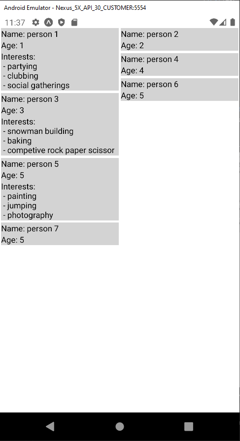
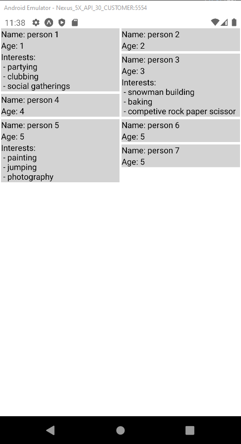

# Masonry-layout-split

A simple function made for generating a masonry layout split with any type of items. The aim of the function is to utilize the space on the screen by using the height of each item to determine which column the next item should be placed in.

The function takes three parameters:
| Parameter | Description |
| --------- | ----------- |
|`items`| The items that will be split into the masonry layout. |
|`numberOfColumns`| The number of desired columns, for instance 2 columns. |
|`calculateHeight`| A function that calculates the height of each item. |

The function returns a list of Column objects. The object Column has the following shape:
| Property | Description |
| --------- | ----------- |
|`number`| The number of the column, starting from 0. |
|`height`| The total height of the column. |
|`items`| A list of all the items that are placed in the column. |

## Comparison:

Comparison between https://github.com/hyochan/react-native-masonry-list and masonry-layout-split and highlight when masonry-layout-split proves useful.

Consider the following case, where the height of the cards in the columns can vary a lot. One column might grow out of proportion of the other column, as illustrated in the images below. This is where masonry-layout-split proves really useful, as the height of the items are used to determine which column the next item should be placed in to get a more even split. As mentioned, the calculation of height of each item is provided by the user. An example on how to do this could be a heuristic algorithm to determine the height as done in the example under basic usage.

|                       Masonry-list                       |                           Masonry-layout-split                           |
| :------------------------------------------------------: | :----------------------------------------------------------------------: |
|  |  |

## Basic usage:

```
npm i masonry-layout-split
```

```tsx
import useMasonryLayoutSplit from 'masonry-layout-split';
```

### Custom hook in react native:

The function works great as a custom hook in React or React Native.

```jsx
import { View, Text, StyleSheet } from 'react-native';
import useMasonryLayoutSplit from 'masonry-layout-split';

interface Person {
  name: string;
  age: number;
  interests: string[];
}

export default function app() {
  const data: Person[] = [
    { name: 'person 1', age: 1, interests: ['partying', 'clubbing', 'social gatherings'] },
    { name: 'person 2', age: 2 },
    { name: 'person 3', age: 3, interests: ['snowman building', 'baking', 'competive rock paper scissor'] },
    { name: 'person 4', age: 4 },
    { name: 'person 5', age: 5, interests: ['painting', 'jumping', 'photography'] },
    { name: 'person 6', age: 5 },
    { name: 'person 7', age: 5 },
  ];

  function getEstimatedHeight(person: Person) {
    return person.interests.length;
  }

  const columns = useMasonryLayoutSplit(data, 2, getEstimatedHeight);

  return (
    <View style={styles.container}>
      {columns.map((column, index) => {
        return (
          <View style={styles.column}>
            {column.items.map((item, index) => {
              return (
                <View style={styles.item}>
                  <Text>Name: {item.name}</Text>
                  <Text>Age: {item.age}</Text>
                  {item.interests && (
                    <Text>
                      Interests:{'\n - '}
                      {item.interests.join('\n - ')}
                    </Text>
                  )}
                </View>
              );
            })}
          </View>
        );
      })}
    </View>
  );
}

const styles = StyleSheet.create({
  container: {
    flex: 1,
    flexDirection: 'row',
    marginTop: 20,
  },
  column: {
    width: '50%',
  },
  item: {
    backgroundColor: 'lightgrey',
    margin: '1%',
  },
});
```
